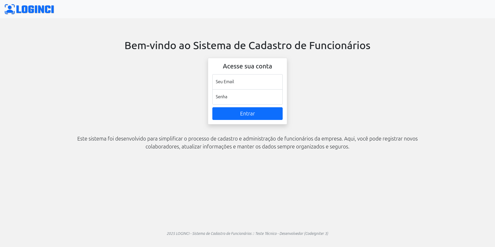
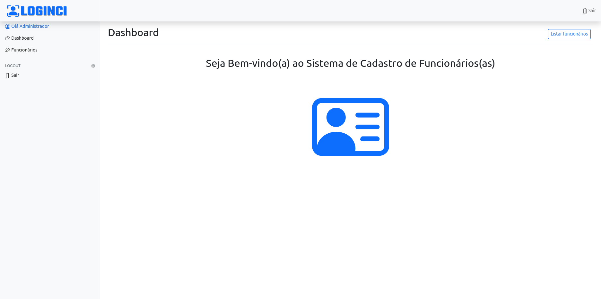
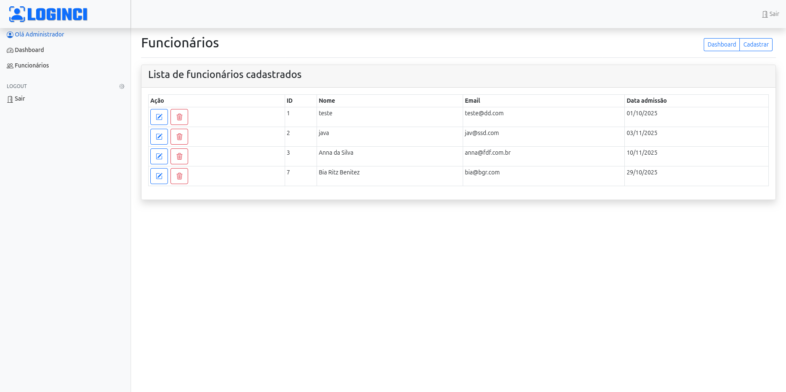
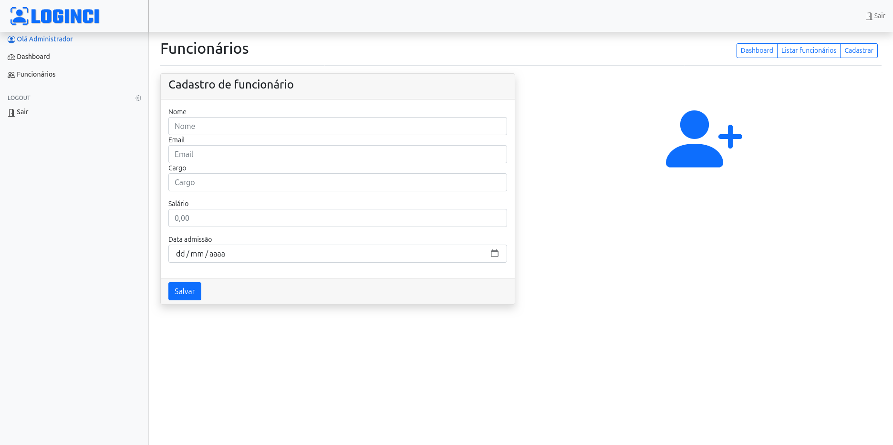
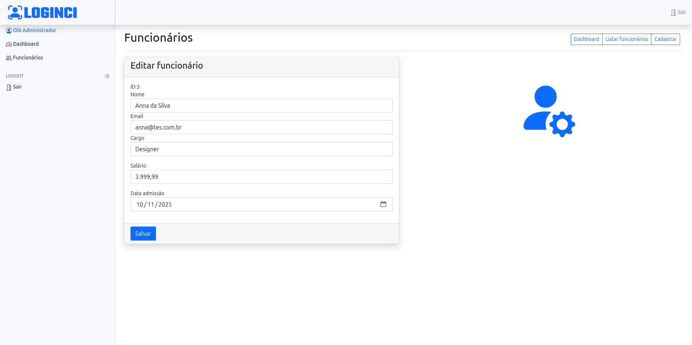
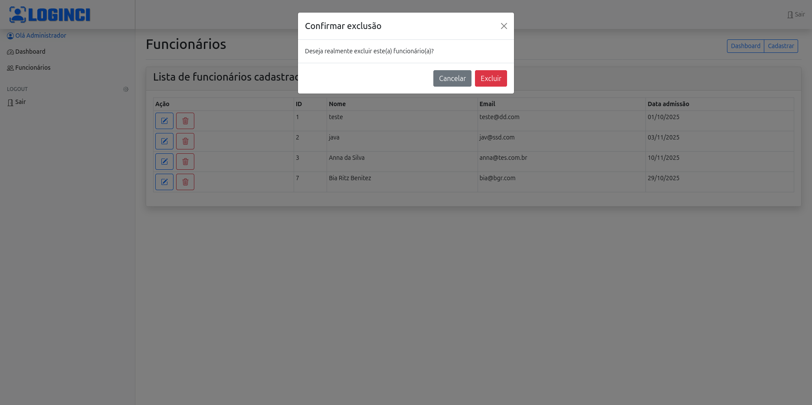

# 🔐 LOGINCI — Sistema de Login em CodeIgniter 3

**Teste Técnico – Desenvolvedor (CodeIgniter 3)**  

Este projeto tem como objetivo implementar um **sistema simples de autenticação, cadastro e edição de funcionários**, desenvolvido para atender aos requisitos do **Teste Técnico – Desenvolvedor (CodeIgniter 3)** da empresa **Instituto Mollitiam**.  

O ambiente é totalmente **containerizado com Docker**, utilizando **CodeIgniter 3**, **PostgreSQL** e **Bootstrap 5**.

---

## ⚙️ Tecnologias Utilizadas

| Camada | Tecnologia |
|--------|-------------|
| Linguagem | PHP 7+ |
| Framework | CodeIgniter 3.x |
| Banco de Dados | PostgreSQL 13 |
| Frontend | Bootstrap 5 + jQuery |
| Controle de Versão | Git / GitHub |
| Containerização | Docker e Docker Compose |

---

## ✨ Funcionalidades

- 🔑 Login e autenticação por e-mail e senha  
- 🧾 Armazenamento de credenciais na tabela `users`  
- 📊 Redirecionamento para o **Dashboard** após login  
- 🚪 Logout do sistema 
- 📋 Listagem de funcionários com ações de **editar** e **excluir**  
- ➕ Formulário de **cadastro e edição** de funcionários  
- ⚠️ Confirmação antes da exclusão (via **modal Bootstrap**)  
- ⚡ Operações via **jQuery/AJAX**  

---

## 🔑 Usuário Padrão para Teste

| Campo | Valor |
|--------|--------|
| **E-mail** | `admin@example.com` |
| **Senha** | `123456` |

---

## 🐘 Banco de Dados e Migração

Na pasta [`sql/`](sql/) há dois arquivos usados automaticamente durante a montagem dos containers:

- **`enable-pgcrypto.sql`** – habilita a extensão `pgcrypto` no PostgreSQL, necessária para usar a função `crypt()`.  
- **`init.sql`** – cria a estrutura de tabelas utilizadas pelo sistema.  

A migração é executada automaticamente conforme definido no arquivo [`docker-compose.yml`](docker-compose.yml).

---

## 🖼️ Telas do Sistema

### Tela de Login

### Dashboard

### Listar Funcionários

### Cadastro de Funcionário

### Editar Funcionário

### Excluir Funcionário

---

## 🚀 Como Executar o Projeto

1. **Clone o repositório**
	git clone https://github.com/macdbr/loginci.git

2. **Cria uma imagem Docker:** 
	docker compose build

3. **Suba os containers**  
	docker-compose up -d

4. **Acesse o sistema via navegador:**
	http://localhost:8080

🧠 Observações

O sistema utiliza a extensão pgcrypto para armazenar senhas de forma criptografada.
O ambiente Docker cria automaticamente o banco e popula as tabelas na primeira execução.	

👨‍💻 Autor

Marcelo Costa.
Desenvolvedor PHP / CodeIgniter - 
📧 macdbr@gmail.com